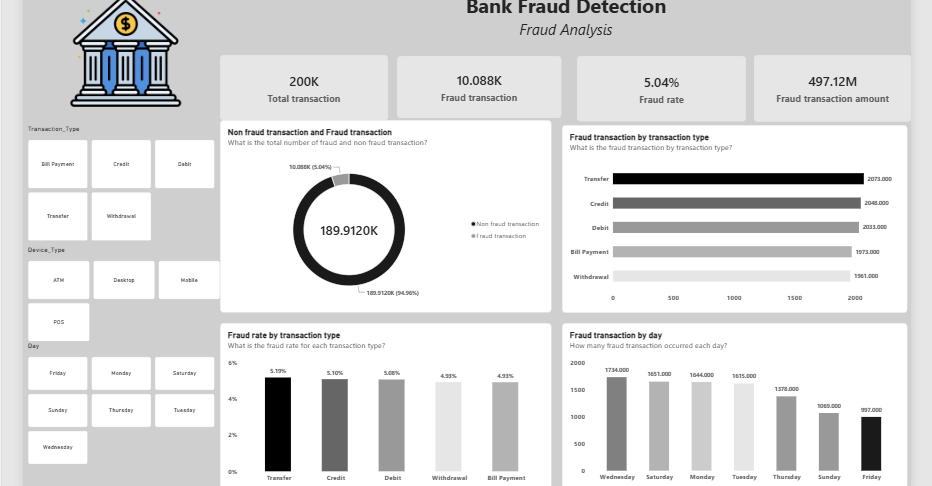
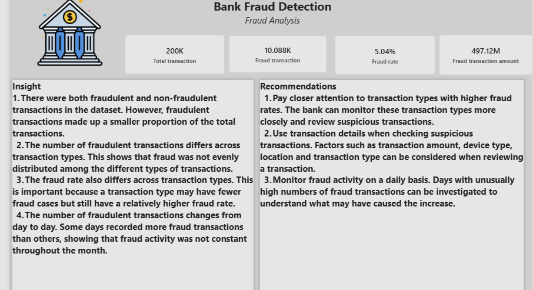
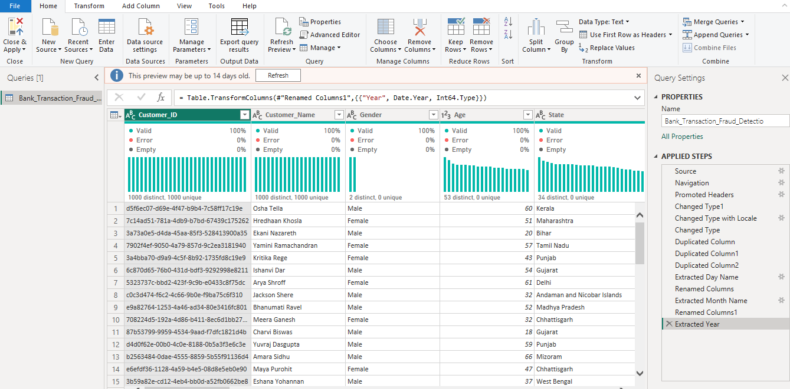

 Bank Fraud Detection Analysis

## Project Overview

This project analyzes banking transaction data to identify patterns and trends associated with fraudulent transactions.

The analysis was carried out using Power BI, with a focus on data cleaning, transformation, visualization, and generating insights that can support fraud monitoring and decision-making.

## Dashboard Preview

## Objectives

- Analyze transaction patterns and fraudulent transactions.

- Identify trends across transaction types and merchant categories.

- Examine fraud patterns across different customer and transaction characteristics.

- Create an interactive dashboard to communicate key findings.

## Tools Used

- Power BI

- Power Query

- DAX

- Excel

## Key Areas of Analysis

- Fraudulent vs. non-fraudulent transactions

- Transaction types

- Merchant categories

- Transaction amounts

- Customer demographics

- Account types

- Device types

- Transaction locations

## Dashboard

The Power BI dashboard presents key metrics, trends, and patterns identified from the transaction data.

## Key Insights

Insights from the analysis will be documented here after completing the dashboard analysis.

## Recommendations

